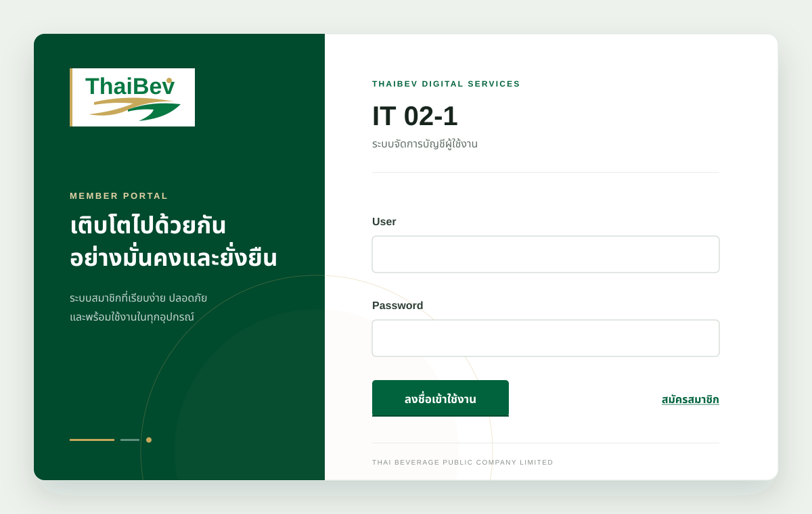

# IT 02 — สมัครสมาชิก / ลงชื่อเข้าใช้งาน

โจทย์ตามเอกสาร `No2.docx`: โปรแกรมที่มี 3 หน้าจอ

| หน้าจอ | เส้นทาง | หน้าที่ |
| --- | --- | --- |
| IT 02-1 | `/login` | กรอก User / Password แล้วลงชื่อเข้าใช้งาน พร้อมลิงก์ไปหน้าสมัครสมาชิก |
| IT 02-2 | `/register` | กรอก User / Password / Confirm Password (ต้องตรงกัน) แล้วกลับมายัง IT 02-1 |
| IT 02-3 | `/welcome` | แสดง `Welcome User : xxx` เข้าได้เมื่อ token ผ่านการตรวจสอบเท่านั้น |

ข้อกำหนดที่โจทย์ระบุไว้ และที่อยู่ของมันในโค้ด:

| ข้อกำหนด | ทำที่ไหน |
| --- | --- |
| Password แสดงเป็น `*` | `<input type="password">` ใน [`FormField.vue`](frontend/src/shared/ui/FormField.vue) |
| Password กับ Confirm Password ต้องตรงกัน | ตรวจทั้งสองฝั่ง: [`credentials.ts`](frontend/src/features/auth/model/credentials.ts) ในเบราว์เซอร์ และ [`domain/user.go`](backend/internal/domain/user.go) ที่เซิร์ฟเวอร์ |
| รหัสผ่านที่เก็บต้องเข้ารหัส | bcrypt (salt ต่อรหัสผ่าน) ใน [`bcrypt_hasher.go`](backend/internal/infrastructure/security/bcrypt_hasher.go) — ฐานข้อมูลเก็บเฉพาะค่าที่เข้ารหัสแล้ว |
| validate Token เป็นแบบ JWT | ออก/ตรวจ HS256 ใน [`jwt.go`](backend/internal/infrastructure/token/jwt.go) บังคับใช้ที่ [`authentication.go`](backend/internal/httpapi/authentication.go) |
| โครงสร้างฐานข้อมูลออกแบบตามที่เหมาะสม | [Supabase migration](supabase/migrations/20260922000000_create_app_users.sql) |

## ตัวอย่างหน้าจอ Frontend

หน้าเว็บใช้ธีมสีเขียว–ทองและแบ่งพื้นที่แบรนด์ออกจากแบบฟอร์มอย่างชัดเจน โดยใช้รูปแบบเดียวกันในหน้า Login, Register และ Welcome พร้อมปรับเป็นแนวตั้งอัตโนมัติเมื่อเปิดบนมือถือ



---

## เริ่มใช้งาน

ต้องมี **Go 1.25+** และ **Node.js 20.19+ / 22.12+** (ข้อกำหนดของ Vite 7)

```bash
cp .env.example .env
openssl rand -base64 48          # นำค่าที่ได้ไปใส่ JWT_SECRET ใน .env
supabase db push                 # apply PostgreSQL migration ไปยัง Supabase
# นำ connection string จาก Supabase Dashboard ใส่ DATABASE_URL ใน .env

make install                     # ติดตั้ง dependency ทั้งสองฝั่ง
make dev                         # รัน API :4201 และเว็บ :4200 พร้อมกัน
```

เปิด <http://localhost:4200>

คำสั่งอื่นดูได้จาก `make help` — ที่ใช้บ่อยคือ `make test` (ทดสอบทั้งสองฝั่ง),
`make check` (fmt + vet + test + typecheck) และ `make build`

ฐานข้อมูลใช้ Supabase PostgreSQL ผ่าน `DATABASE_URL` และต้อง apply migration
ก่อนเริ่ม API ดูขั้นตอนสร้าง role, SSL และ connection mode ที่
[`backend/DATABASE.md`](backend/DATABASE.md)

### ไฟล์ตั้งค่า

| ไฟล์ | คัดลอกไปเป็น | จำเป็นไหม |
| --- | --- | --- |
| [`.env.example`](.env.example) | `.env` | **ต้องมี** — ต้องกรอก `JWT_SECRET` และ `DATABASE_URL` |
| [`frontend/.env.example`](frontend/.env.example) | `frontend/.env.local` | ไม่จำเป็นตอน dev (ค่า default ชี้ไปที่ `localhost:4201` อยู่แล้ว) แต่ต้องตั้งเมื่อ build ขึ้น production |

ทั้งสองไฟล์ระบุตัวแปรทุกตัวที่โปรแกรมอ่านจริง พร้อมค่า default กำกับไว้
ตัวที่ comment ไว้คือใช้ค่า default ได้เลย ไม่ต้องแก้

มีสองจุดที่สองฝั่งต้องตรงกัน ไม่ตรงแล้วเบราว์เซอร์จะ error แบบอ่านไม่รู้เรื่อง:

1. `VITE_API_BASE_URL` (frontend) ต้องชี้ไปที่ที่ backend เปิดฟังอยู่จริง (`HTTP_ADDRESS`)
2. `CORS_ALLOWED_ORIGINS` (backend) ต้องมี origin ของ frontend อยู่ในลิสต์
   โดยต้องตรงทั้ง scheme, host และ port

> ห้ามใส่ค่าที่เป็นความลับลงในไฟล์ฝั่ง frontend — Vite จะ compile ตัวแปร `VITE_*`
> ลงไปใน bundle ใครเปิดเว็บก็อ่านได้ `JWT_SECRET` และ `DATABASE_URL`
> เป็น secret ของ backend เท่านั้น

---

## จัดการ secret ด้วย Infisical (ทางเลือก)

`make dev` อ่าน `JWT_SECRET` จากไฟล์ `.env` ซึ่งเร็วและพอสำหรับการตรวจงาน
แต่แปลว่ามี secret วางอยู่เป็นไฟล์บนเครื่อง ถ้าไม่ต้องการแบบนั้น
มี target อีกชุดที่ดึง secret จาก [Infisical](https://infisical.com) มาใส่ให้ตอนรัน

```bash
brew install infisical/get-cli/infisical      # แพลตฟอร์มอื่นดู infisical.com/docs/cli/overview
infisical login                               # ครั้งเดียวต่อเครื่อง
infisical init                                # สร้าง .infisical.json ผูกกับ project ของคุณ

infisical secrets set JWT_SECRET="$(openssl rand -base64 48)"
infisical secrets set DATABASE_URL="<postgresql-connection-string>"

make dev-secure                               # API :4201 + เว็บ :4200
```

| Target | ใช้ทำอะไร |
| --- | --- |
| `make backend-secure` | รัน API อย่างเดียว โดยรับ secret จาก Infisical |
| `make dev-secure` | เหมือน `make dev` แต่ secret ของ API มาจาก Infisical |
| `make secrets` | แสดงรายการ secret ที่จะถูกฉีดเข้าไป (ไว้ตรวจก่อนรัน) |

เลือก environment ได้ด้วย `INFISICAL_ENV` เช่น `make backend-secure INFISICAL_ENV=staging`
(ค่าเริ่มต้นคือ `dev`)

### ทำไมไม่ต้องแก้โค้ด Go เลย

`infisical run` ฉีด secret เข้าไปเป็น environment variable ของ process ลูก
ซึ่งตรงกับที่ [`config.Load()`](backend/internal/config/config.go) อ่านอยู่แล้ว —
ทั้งโปรแกรมมีที่เดียวที่แตะ `os.Getenv` อยู่แล้ว การเพิ่ม Infisical จึงไม่ต้องแก้
source ฝั่ง Go แม้แต่บรรทัดเดียว และไม่เพิ่ม dependency ให้ binary

อีกด้านหนึ่งคือ **ไม่ผูกตาย**: ถ้าไม่มี Infisical CLI ก็ยังใช้ `make dev` กับ `.env`
ได้ตามปกติ ซึ่งสำคัญสำหรับงานที่ต้องส่งให้คนอื่น clone แล้วรันได้ทันที

### รายละเอียดที่ตั้งใจใส่ไว้

- target ชุด `-secure` ล้าง `JWT_SECRET` และ `DATABASE_URL` ก่อนเรียก CLI เสมอ
  ถ้ามีค่าเก่าค้างอยู่ใน `.env` มันจะถูก export ไปอยู่ใน environment ด้วย
  แล้วจะกลายเป็นว่าไม่แน่ใจว่า API เซ็น token ด้วยค่าไหน การล้างทิ้งก่อน
  ทำให้ secret มาจาก Infisical ทางเดียว และถ้า Infisical ไม่มีค่านี้
  API จะหยุดตั้งแต่ตอนเริ่มทำงานพร้อมข้อความที่ชัดเจน แทนที่จะเงียบ ๆ ใช้ค่าเก่า
- ใช้ `--project-config-dir=..` เพราะ API ถูกสั่งรันจากโฟลเดอร์ `backend/`
  ขณะที่ `.infisical.json` อยู่ที่ราก repository
- `.infisical.json` สร้างจาก `infisical init` เท่านั้น เพราะต้องมี project ID จริง
  ในไฟล์ ดูรูปแบบได้ที่ [`.infisical.example.json`](.infisical.example.json)
  ไฟล์นี้ไม่มี secret อยู่ข้างใน commit ลง git ได้

### บน CI หรือตอน deploy

ที่ที่ล็อกอินแบบ interactive ไม่ได้ ให้ใช้ machine identity แล้วส่งผ่าน `INFISICAL_TOKEN`

```bash
export INFISICAL_TOKEN=$(infisical login --method=universal-auth \
  --client-id="$INFISICAL_CLIENT_ID" \
  --client-secret="$INFISICAL_CLIENT_SECRET" --silent --plain)

export INFISICAL_DISABLE_UPDATE_CHECK=true    # แนะนำสำหรับ production

infisical run --projectId="$INFISICAL_PROJECT_ID" --env=prod -- ./it02-auth-api
```

---

## สถาปัตยกรรม

### Backend — Go, layered architecture แบบเรียบง่าย

ทิศทางการพึ่งพาชี้เข้าด้านในเสมอ ชั้นในไม่รู้จักชั้นนอก

```
cmd/api                     composition root — ประกอบ dependency และเริ่ม HTTP server
└── internal
    ├── httpapi             handler, DTO, route และ middleware
    ├── service             use case (Register / Login / CurrentUser) + interface
    ├── domain              entity, validation และ business error
    ├── repository/postgres UserRepository และ connection pool (pgx)
    ├── infrastructure      adapter ด้านเทคนิค
    │   ├── security        bcrypt hasher
    │   ├── token           JWT signer / verifier
    │   └── id              ตัวสร้าง UUID
    └── config              อ่านและ validate environment
```

เส้นทางหลักของ request คือ `httpapi → service → domain` โดย `service` เรียก
repository และ security ผ่าน interface ส่วน `cmd/api` เป็นจุดเดียวที่เลือก
implementation จริง ทำให้ตามโค้ดง่ายและไม่เกิด dependency ย้อนชั้น

ผลที่ได้จากการแบ่งแบบนี้:

- `domain` ทดสอบได้โดยไม่ต้องมีฐานข้อมูล และไม่มีข้อความภาษาไทยปนอยู่เลย
  (การแปลง `ViolationCode` เป็นประโยคเป็นหน้าที่ของ [`validation.go`](backend/internal/httpapi/validation.go))
- database schema เป็น versioned migration ใน `supabase/migrations`
- เปลี่ยนอัลกอริทึม hash หรือรูปแบบ token = แก้ไฟล์เดียวใน `infrastructure`

### Frontend — Vue 3 (Composition API + `<script setup>`), แบ่งตาม feature

```
src
├── main.ts                 composition root ของฝั่งเว็บ
├── app/router.ts           route + guard
├── shared
│   ├── api                 HttpClient และ ApiError — ที่เดียวที่เรียก fetch
│   └── ui                  component ที่ใช้ร่วมกัน (FormPanel, FormField, ...)
└── features/auth
    ├── model               type, กฎ validate, ที่เก็บ token
    ├── api                 หนึ่งฟังก์ชันต่อหนึ่ง endpoint
    ├── stores              Pinia store — สถานะ session หนึ่งเดียวของทั้งแอป
    └── pages               สามหน้าจอ
```

หน้าจอไม่เรียก `fetch` เอง ไม่แตะ `sessionStorage` เอง และไม่รู้จัก URL ของ API
ทุกอย่างผ่าน store → api → HttpClient ตามลำดับ

---

## API

| Method | Path | ใช้ทำอะไร |
| --- | --- | --- |
| `POST` | `/api/auth/register` | สมัครสมาชิก → `201` พร้อมข้อมูลบัญชี (ไม่มี token) |
| `POST` | `/api/auth/login` | ลงชื่อเข้าใช้ → `200` พร้อม access token |
| `GET` | `/api/auth/me` | ตรวจ token และบอกว่าเป็นของใคร (ต้องมี `Authorization: Bearer`) |
| `GET` | `/health` | ตรวจว่า API ต่อฐานข้อมูลได้ |

สถานะที่ตอบกลับ: `400` ข้อมูลไม่ผ่านกฎ (มีรายละเอียดรายฟิลด์),
`401` รหัสผ่านไม่ถูกต้องหรือ token ใช้ไม่ได้, `409` ชื่อผู้ใช้ซ้ำ,
`415` content type ไม่ใช่ JSON

ตัวอย่าง:

```bash
curl -X POST http://localhost:4201/api/auth/register \
  -H 'Content-Type: application/json' \
  -d '{"username":"Somchai","password":"sup3r-secret","confirmPassword":"sup3r-secret"}'
```

---

## เรื่องความปลอดภัยที่ตั้งใจทำ

- **รหัสผ่าน** เก็บเป็น bcrypt (cost 11) ซึ่งมี salt ต่อรหัสผ่านอยู่ในค่าเดียวกัน
  รหัสผ่านเดียวกันจึงไม่เคยได้ค่าเท่ากันสองครั้ง และ entity `domain.User`
  ไม่มีฟิลด์สำหรับ plaintext เลย
- **สมัครซ้ำ** กันด้วย unique index บน `username_canonical` ไม่ใช่แค่การเช็คในโค้ด
  เพราะการสมัครพร้อมกันสองครั้งจะผ่านการเช็คได้ทั้งคู่
- **ลงชื่อเข้าใช้ไม่สำเร็จ** ตอบเหมือนกันทั้งกรณีไม่มีชื่อผู้ใช้นั้นและรหัสผ่านผิด
  เพื่อไม่ให้ใช้หน้านี้ไล่เดาว่ามีบัญชีใดอยู่บ้าง
- **JWT** ตรวจด้วย HS256 ที่ระบุอัลกอริทึมตายตัว (กัน token ปลอมแบบ `alg: none`)
  พร้อมตรวจ `iss`, `aud` และบังคับว่าต้องมี `exp`
- **token** เก็บใน `sessionStorage` และหน้า IT 02-3 อ่านชื่อผู้ใช้จาก `/api/auth/me`
  ไม่ใช่จาก payload ของ token เพราะ JWT เซ็นชื่อไว้แต่ไม่ได้เข้ารหัส
  มีแต่เซิร์ฟเวอร์เท่านั้นที่บอกได้ว่าลายเซ็นถูกต้อง
- **route guard** เป็นเพียงความสะดวก ข้อมูลหลัง `/welcome` มาจาก endpoint
  ที่ตรวจ token เองอยู่แล้ว
- **CORS** เป็น allowlist ไม่ใช่ `*` เพราะ API นี้รับ `Authorization` header
- **PostgreSQL** เก็บผู้ใช้ใน `public.app_users` และเปิด RLS โดยไม่มี frontend
  policy เพราะหน้าเว็บเรียกข้อมูลผ่าน Go API เท่านั้น
- **`JWT_SECRET`** ไม่มีค่า default และไม่สุ่มให้เอง เซิร์ฟเวอร์ที่สุ่ม secret
  ตอนเริ่มทำงานจะทำให้ token ที่ออกไปก่อนหน้าใช้ไม่ได้ทั้งหมดอย่างเงียบ ๆ

---

## การทดสอบ

```bash
make test           # ทั้งสองฝั่ง
make test-backend   # go test ./...
make test-frontend  # vitest
```

**Backend** — ครอบคลุมทุกชั้น: กฎใน `domain`, use case ใน `service`
(ใช้ fake ของทุก port), adapter จริงทั้ง bcrypt / JWT, PostgreSQL repository และ
`httpapi` ที่ประกอบทั้ง stack แล้วยิง request จริงผ่าน `httptest`

**Frontend** — กฎ validate, HttpClient (แทน `fetch`), Pinia store,
route guard และทั้งสามหน้าจอผ่าน Testing Library (คลิกและพิมพ์แบบผู้ใช้จริง)

ตัวอย่างสิ่งที่ทดสอบไว้ นอกเหนือจาก happy path: รหัสผ่านยืนยันไม่ตรง,
ชื่อผู้ใช้ซ้ำแบบต่างตัวพิมพ์, token หมดอายุ / ปลอม / มาจากผู้ออกอื่น,
`alg: none`, กดปุ่มสมัครซ้ำระหว่างรออยู่ และกรณีต่อเซิร์ฟเวอร์ไม่ได้
